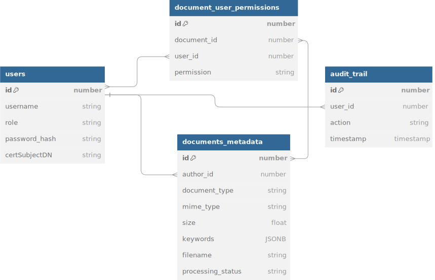

# document-processing-system
Document processing system should securely process and stores documents and provide a user interface for interacting with these documents.

## General system components
The system consists of major five components interacting together:
* **Document processing backend** should securely process and store documents.
* **External API** should be integrated with document processing backend, provides additional functionalities for documents. 
* **Postgres database** should securely store and handle relationships between data of users, documents metadata, and audit trail.  
* **Docker volume** should be the storage file system on which the files are stored and encrypted.
* **Client-side application**: should be an interface for users and admins to interact with the system. 

## System architecture

## Database UML diagram

## How to run using docker
- Clone the repo
- Inside *document-processing-backend* add `.env` such as `.env.example file`
- Inside *external-api* add `.env` such as `.env.example file`
- Run `docker-compose.yml` file using command `docker-compose up -d`

> Docker containers communicate with each other using bridge network driver as defined in `docker-compose.yml`

## After running `docker-compose.yml`
Open the front-end on the running port `e.g. http://localhost:3002/html/index.html` to see the home page.

> You can go to the host and port of document processing system and test using swagger
for example if it is running on port 3001 you can open `http://localhost:3001/docs` to test using swagger as the front-end is so pleasant regarding user experience

## Further Improvements 
* Implement document encryption on file storage level and encrypt keys in the keywords jsonb field (python dictionary) and handle searching encrypted words efficiently
* Handle granting user permission on admin level to grant users different levels of permissions on specific files (there is already a conjuction table that handles user-document permissions)
* Implement client-side code that tracks documents processing status and handle batch files uploads

